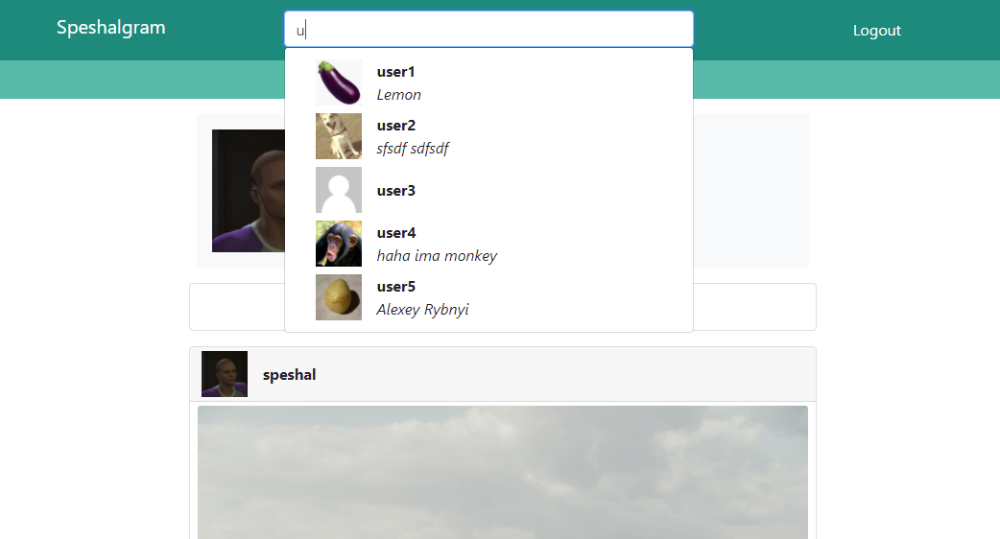

# Speshalgram

## Первый запуск

1. Сборка и запуск севрвисов
    ``` 
    docker-compose up -d --build 
    ```

2. Создание бд таблиц
    ```
    docker-compose exec back python manage.py migrate
    ```

3. Создание суперпользователя
    ```
    docker-compose exec back python manage.py createsuperuser
    ```

4. Копирование аватарки по умолчанию в медиафайлы проекта
    <pre>docker container  cp <i>&lt;путь до default_avatar.png&gt;</i> <i>&lt;полное имя back-сервиса&gt;</i>:/resources/media/</pre>

5. (docker-compose.prod.yaml) Сбор статических файлов для админки в static root
    ```
    docker-compose exec back python manage.py collectstatic
    ```

## Возожности

- Регистрация/редактирование пользователей
- Открытые и закрытые (посты и подписки пользователя видны только его подписчикам) аккаунты 
- Подгружаемая лента новостей (последные посты друзей)
- Возможность оставить лайк под постом
- Возможность посмотреть комментарии к посту / оставить свой
- Поиск пользователей по никнейму
- Подгружаемый списки подписок/подписчиков
- Подгружаемые списки пользователей, лайкнувших пост
- Входящие/исходящие запросы на подписку

## Некоторые скриншоты

- Профиль пользователя
    

- Список подписчиков пользователя
    

- Пользователи, лайкнувшие пост
    

- Поиск пользователя по никнейму
    

- Закрытый аккаунт
    

- Список входящих запросов на подписку
    

- Лента новостей друзей
    

- Модальное окно редактирования профиля
    